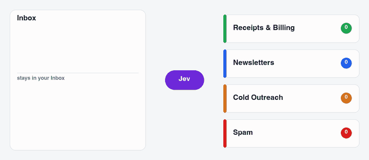

# jev-imap-router

<p align="center">
  
</p>

AI inbox sorting for any IMAP mailbox, including Gmail, iCloud, Fastmail, Outlook.com, Yahoo and your
own domain.

You describe your categories in plain English and [Jev](https://docs.typesafe.ai/introduction) picks
one for each email. Emails are filed on your mail server, so Apple Mail, Outlook, your phone and
webmail all see the same folders. Nothing is ever deleted.

## Set it up with your coding agent

Paste this into Claude Code, Codex, Cursor or any agent that can run commands:

```
Set up jev-imap-router for me by following https://raw.githubusercontent.com/bquigley1/jev-imap-router/main/SETUP.md
```

Your agent installs the tool, reads a summary of who emails you, designs categories that fit your mail
and shows you a preview of where everything would go. You only do two things yourself. You enter your
email app password and a [TypeSafe API key](https://console.typesafe.ai/keys) in your own terminal, so
they never pass through the agent. And you say when to turn it on.

Nothing in your mailbox changes until you say so.

## Set it up yourself

You need [uv](https://docs.astral.sh/uv/), an app password for your email and a TypeSafe API key.

```sh
uv tool install jev-imap-router
jev-imap-router init        # your email address and a starting set of categories
jev-imap-router preview     # classify your 300 most recent emails without moving anything
jev-imap-router review      # see where everything would go
```

`init` asks for your password and API key and saves them to your system keychain. It fills in the mail
server for Gmail, iCloud, Outlook.com, Yahoo, Fastmail, AOL, Zoho, Proton (through Bridge) and
Namecheap Private Email, and looks up the MX record for custom domains.

When the review looks right, set `mode: live` in `~/.jev-imap-router/config.yaml` and run:

```sh
jev-imap-router backfill --limit 5000    # sort existing mail, newest first
jev-imap-router install-agent            # sort new mail as it arrives (macOS)
```

## Categories

`init` starts you with one of four presets: Universal, Founder/operator, Sales or Freelancer/creator.
Each one has Inbox categories for that kind of work plus shared filing folders for receipts,
newsletters, notifications, promotions, calendar, travel, cold outreach and junk.

The agent setup above replaces the preset with categories built from your own mail, which works
better. You can also edit them yourself in `config.yaml`:

```yaml
- name: Receipts & Billing
  when: >-
    Receipts, invoices and payment confirmations when there's no problem to fix,
    including Stripe, GitHub and AWS receipts. Problems are Action Required.
  action: move            # keep = stays in the Inbox, move = filed under Sorted/
  min_confidence: 0.85
```

Jev reads `when` literally, so name real senders and spell out what doesn't belong. It accepts up to
255 categories, but 8 to 16 clear ones work best.

## How it decides

Each email gets one Jev call with the full picture. That includes the headers, up to 12,000 characters
of body text and a set of sender checks computed in code. The checks cover whether the sender's own
domain signed the email, whether the display name claims another brand or your own domain, where the
links really point, lookalike and throwaway domains, risky attachments and fake "Re:" threads. Your
provider's own spam verdict is left out on purpose so that Jev doesn't simply copy it.

An email is only filed when Jev is confident it belongs in a folder. When Jev is split between two
folders such as Newsletters and Promotions, their probabilities are added together and the email is
filed under the stronger one. When there's a real chance an email is personal or needs action, it
stays in the Inbox.

Conversations you're part of are never filed. That covers anything you've replied to and any genuine
reply or forward.

Mail only goes to Spam when Jev picks Junk and also rates it as a likely scam or finds a clear red flag
like brand impersonation. Many providers' spam filters learn from what you move into Spam, so this
rule is deliberately strict.

New setups start in preview mode, which logs every decision to
`~/.jev-imap-router/logs/decisions.jsonl` without touching your mailbox.

## Cost and speed

Jev charges for input tokens only, currently $0.042 per million. On a real mailbox of about 11,000
emails it cost **about $0.14 per 1,000 emails** and sorted **about 200 emails a minute**. Downloading
mail from the server was the slowest part. The config has a daily spending limit of $2 by default, and
`jev-imap-router stats` shows your own numbers.

Here's what the same work would cost on general-purpose models at September 2026 list prices:

| Model | Cost per 1,000 emails | vs Jev |
|---|---:|---:|
| **Jev** | **$0.14** | 1× |
| Kimi K2.6 | $3.42 | 24× |
| Claude Haiku 4.5 | $3.65 | 26× |
| GPT-6 Sol / Claude Sonnet 5 | $7.30 | 52× |
| Gemini 3 Pro | $7.42 | 53× |
| Claude Opus 5 | $18.24 | 130× |
| GPT-6 Astra / Claude Fable 5.1 | $36.49 | 259× |

These figures use the same 3,350 input tokens per email plus a 60-token answer. Reasoning models would
cost more because they also charge for thinking tokens. The table compares price only, not accuracy.

## Privacy

Headers and up to 12,000 characters of text from each email are sent to TypeSafe's API for
classification. You can read about [how TypeSafe handles data](https://docs.typesafe.ai/models).
Nothing else leaves your machine, and the samples used to design categories stay in
`~/.jev-imap-router/logs/`.

## Limitations

- `install-agent` uses macOS launchd. On Linux you can run `jev-imap-router watch` under systemd for now.
- Microsoft 365 work accounts that require OAuth for IMAP aren't supported yet. App passwords work.
- Gmail treats IMAP folders as labels, so filing an email adds a `Sorted/...` label and removes it from
  the Inbox.

## Credits

This project was inspired by [jevMail](https://github.com/ilyamk/jev-gmail-ai-spam-filter-and-labeling)
by Ilia AGI, which does the same for Gmail through Google Apps Script. The presets and classification
policy are adapted from it under the MIT license. Classification is done by
[Jev](https://docs.typesafe.ai/introduction) from TypeSafe.

## License

MIT
